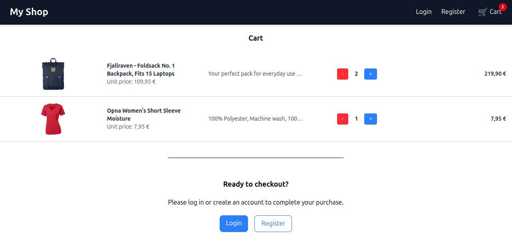

# 🛒 Demo Project: E-Commerce Store

This is a full-stack demo project called **E-Commerce Store**.  
It showcases a dynamic product catalog using data from the Fake Store API, featuring a robust backend for order processing and user management.

👉 [API Documentation](https://fakestoreapi.com/docs)

## 🚀 Features

- **Product Discovery:** Display of product cards.
- **Authentication & Authorization:** Secure user login and role-based access.
- **Shopping Cart:** Seamless cart management using React Context.
- **Order Processing:** Integration with MongoDB to store and track orders.
- **Order Confirmations:** Automatic generation of order confirmations as PDF files via PDFkit.
- **Strict Validation:** End-to-end data integrity using Zod and TypeScript.
- **Responsive UI:** Clean, modern design built with Tailwind CSS.

## 🛠 Tech Stack

### Frontend

- **React** (useState, useEffect, useContext, React Router)
- **TypeScript**
- **Tailwind CSS**
- **Zod** (Schema-based validation)

### Backend

- **Node.js & Express.js**
- **MongoDB & Mongoose** (Database)
- **PDFkit** (Document generation)
- **Zod** (Backend validation)

## 👀 Project Preview

## 🌐 Live Demo

🔗 [https://ecommerce-project-5rfy.onrender.com/](https://ecommerce-project-5rfy.onrender.com/)

## 📌 Notes

This project was created for learning and demonstration purposes.
