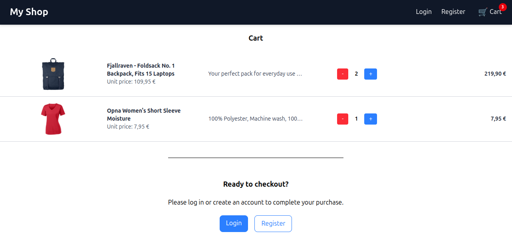

# 🛒 Demo Project: E-Commerce Store

This is a full-stack demo project called **E-Commerce Store**.  
It showcases a dynamic product catalog using data from the Fake Store API, featuring a robust backend for order processing and user management.

👉 [API Documentation](https://fakestoreapi.com/docs)

## 🚀 Features

- **Product Discovery:** Display of product cards.
- **Authentication & Authorization:** Secure user login and role-based access.
- **Shopping Cart:** Seamless cart management using React Context.
- **Order Processing:** Integration with MongoDB to store and track orders.
- **Order Confirmations:** Automatic generation of order confirmations as PDF files via PDFkit.
- **Strict Validation:** End-to-end data integrity using Zod and TypeScript.
- **Responsive UI:** Clean, modern design built with Tailwind CSS.

## 🛠 Tech Stack

### Frontend

- **React** (useState, useEffect, useContext, React Router)
- **TypeScript**
- **Tailwind CSS**
- **Zod** (Schema-based validation)

### Backend

- **Node.js & Express.js**
- **MongoDB & Mongoose** (Database)
- **PDFkit** (Document generation)
- **Zod** (Backend validation)

## 👀 Project Preview



## 🌐 Live Demo

🔗 [https://ecommerce-project-5rfy.onrender.com/](https://ecommerce-project-5rfy.onrender.com/)

## 📖 Swagger API Documentation

🔗 [https://ecommerce-project-b.onrender.com/docs/](https://ecommerce-project-b.onrender.com/docs)
<br>
🔗 [https://ecommerce-project-b.onrender.com/docs/openapi.json](https://ecommerce-project-b.onrender.com/docs/openapi.json)

## 🏗 DevOps & Infrastructure

This project is built with a focus on modern deployment strategies and container orchestration. It includes a fully automated **Blue-Green Deployment** setup to ensure zero downtime during updates.

### Key Infrastructure Features:

- **Containerization:** All services (Frontend, Backend, Proxy) are dockerized for consistent environments.
- **Load Balancing:** Uses `nginx-proxy` to distribute traffic across multiple backend instances.
- **Zero-Downtime Deployment:** A custom Bash script manages the switch between "Blue" and "Green" environments.
- **Health-Driven Orchestration:** Deployments only proceed if the new containers pass an internal health check.
- **Security:** Containers run with non-root users and read-only filesystems where possible.

### 🛠 Local Development & Deployment

#### Development Environment

To start the project in development mode with hot-reloading:

```bash
docker compose -f docker-compose.dev.yml --env-file ./frontend/.env.dev.local --env-file ./backend/.env.dev.local up -d --build
```

#### Standard Production Environment

To run the project in a stable, containerized production mode:

```bash
docker compose -f docker-compose.prod.yml --env-file ./frontend/.env.production.local --env-file ./backend/.env.production.local up -d --build
```

#### High-Availability Environment (Blue-Green)

This setup uses an Nginx-Proxy to load balance traffic between multiple backend replicas and enables zero-downtime deployments.

**Initial Start:**
Depending on which stack you want to start with (Blue or Green), use one of the following commands:

```bash
# Start with Blue stack (2 replicas)
docker compose -f docker-compose.balanced.prod.yml --env-file ./frontend/.env.production.local --env-file ./backend/.env.production.local up -d --build --scale backend-blue=2 backend-blue frontend

# OR: Start with Green stack (2 replicas)
docker compose -f docker-compose.balanced.prod.yml --env-file ./frontend/.env.production.local --env-file ./backend/.env.production.local up -d --build --scale backend-green=2 backend-green frontend
```

### 📜 Deployment Script Description

The included shell script `blue-green-deploy.sh` automates the entire transition between environment stacks. It is designed to be safe, idempotent, and informative.

#### What the script does:

1. **Environment Detection:** Automatically identifies whether `blue` or `green` is currently active.
2. **Pre-deployment Cleanup:** Removes any old or orphaned containers of the target color.
3. **Smart Build:** Builds the new version using the production Dockerfile and environment variables.
4. **Health-Check Validation:** Starts the new instances and polls their status. It waits until all replicas report as `healthy` before proceeding.
5. **Traffic Switch:** Once the new stack is ready, it informs the Nginx-Proxy to route traffic to the new instances.
6. **Automatic Rollback:** If the new instances fail to become healthy within the timeout period, the script aborts and cleans up the failed attempt to keep the current stack running.

#### Manual Execution:

Even if the script is not marked as executable in the repository, you can always run it using this commands:

```bash
chmod +x scripts/blue-green-deploy.sh
bash scripts/blue-green-deploy.sh
```

### 🧹 Cleaning Up

If you want to stop the services and remove all associated resources, use the `down` command. Adding the `-v` flag ensures that all internal Docker volumes and networks are also removed, leaving your system clean.

**To stop and remove the environment:**

```bash
# For Development
docker compose -f docker-compose.dev.yml down -v

# For Standard Production
docker compose -f docker-compose.prod.yml down -v

# For Balanced Production
docker compose -f docker-compose.balanced.prod.yml down -v
```

## 🔐 Environment Variables

Before running the project, you need to set up your environment variables. Create a `.env.intern.local` file (or `.env.development.local` / `.env.production.local` depending on your chosen deployment variant) in the respective folders.

### Backend (`/backend`)

| Variable                 | Development Value                   | Production Value         |
| :----------------------- | :---------------------------------- | :----------------------- |
| `ACCESS_JWT_SECRET`      | _your_secret_                       | _your_secret_            |
| `DB_NAME`                | `ecommerce`                         | `ecommerce`              |
| `CLIENT_BASE_URL`        | `http://localhost`                  | `http://localhost`       |
| `MONGO_URI`              | `mongodb://mongodb:27017/ecommerce` | _your_mongodb_atlas_uri_ |
| `REFRESH_TOKEN_TTL`      | `2592000`                           | `2592000`                |
| `SALT_ROUNDS`            | `10`                                | `10`                     |
| `CONTACT_RECEIVER_EMAIL` | _your_email_                        | _your_email_             |
| `RESEND_API_KEY`         | _your_key_                          | _your_key_               |
| `TURNSTILE_SECRET_KEY`   | _your_key_                          | _your_key_               |

### Frontend (`/frontend`)

| Variable                  | Development Value       | Production Value |
| :------------------------ | :---------------------- | :--------------- |
| `VITE_APP_SERVER_URL`     | `http://localhost:8080` | `/api`           |
| `VITE_TURNSTILE_SITE_KEY` | _your_site_key_         | _your_site_key_  |

> **Note on Databases:**
>
> - **Development Mode:** The `docker-compose.dev.yml` create a local MongoDB container as a service. It starts with an empty database named `ecommerce`.
> - **Production Variants:** Both the standard and balanced production setups are configured to connect to an external **MongoDB Atlas Cluster** (or any managed MongoDB instance). Ensure your `MONGO_URI` in the `.env.production.local` reflects your cloud connection string.

## 📌 Notes

This project was created for learning and demonstration purposes.
